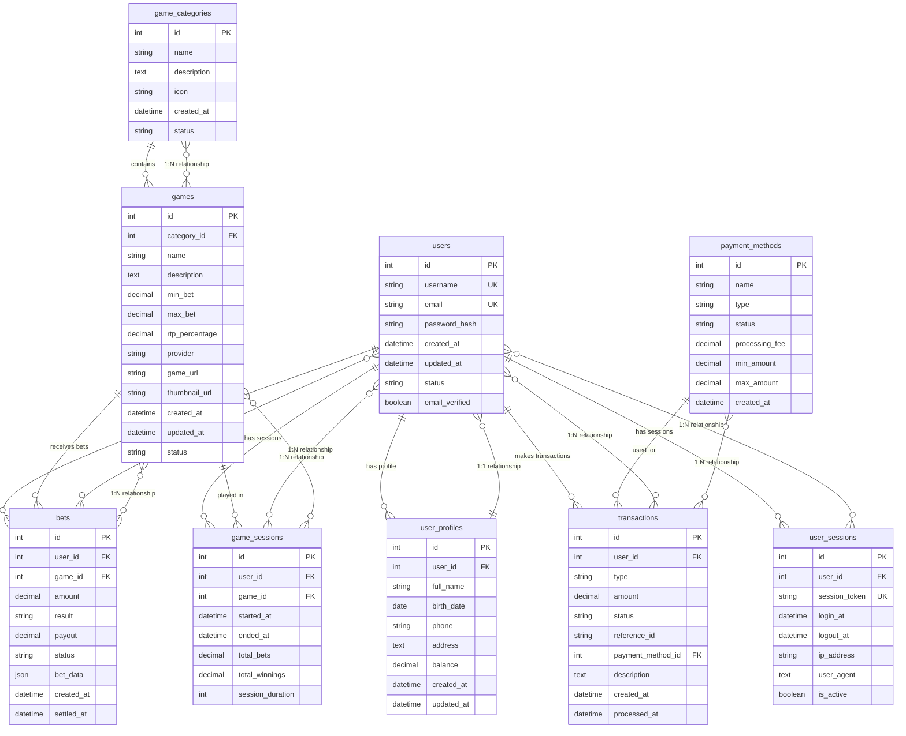

# Casino Betting Platform Database

Um banco de dados SQLite completo para uma plataforma de apostas online focada em jogos de casino (slots, poker, roleta, blackjack, etc.).

## 🎯 Características

- **Foco em Casino**: Especializado em jogos de casino (slots, poker, roleta, blackjack, baccarat, dados)
- **Gestão de Usuários**: Sistema completo de registro e perfis de usuários
- **Sistema de Apostas**: Controle de apostas simples (vitória/derrota)
- **Transações Financeiras**: Histórico completo de depósitos, saques, apostas e ganhos
- **Auditoria**: Rastreamento de sessões e atividades dos usuários

## 🗄️ Diagrama do Sistema de Banco de Dados



## 📁 Estrutura do Projeto

```
database/
├── schema.sql          # Esquema completo do banco de dados
├── seed_data.sql       # Dados de exemplo para testes
├── init_db.py          # Script Python para inicializar o banco
├── queries.sql         # Consultas SQL comuns e exemplos
└── casino_betting.db   # Banco de dados SQLite (gerado automaticamente)
```

## 🚀 Como Usar

### 1. Inicializar o Banco de Dados

```bash
# Executar o script de inicialização
python database/init_db.py

# Ou especificar um caminho customizado
python database/init_db.py meu_banco.db
```

### 2. Estrutura das Tabelas

#### Gestão de Usuários
- **users**: Dados básicos de registro (username, email, senha)
- **user_profiles**: Informações estendidas (nome completo, saldo, telefone)

#### Jogos de Casino
- **game_categories**: Categorias de jogos (Slots, Poker, Roleta, etc.)
- **games**: Jogos disponíveis com limites de apostas e RTP

#### Sistema de Apostas
- **bets**: Registro de todas as apostas (valor, resultado, pagamento)
- **game_sessions**: Sessões de jogo dos usuários

#### Transações Financeiras
- **transactions**: Histórico completo (depósitos, saques, apostas, ganhos)
- **payment_methods**: Métodos de pagamento disponíveis

#### Auditoria
- **user_sessions**: Controle de login/logout

### 3. Consultas Úteis

O arquivo `queries.sql` contém exemplos de consultas para:

- **Gestão de Usuários**: Buscar usuários, perfis, saldos
- **Jogos**: Listar jogos por categoria, provedor
- **Apostas**: Histórico de apostas, estatísticas
- **Financeiro**: Transações, resumos financeiros
- **Analytics**: Estatísticas da plataforma, receita
- **Segurança**: Usuários inativos, padrões suspeitos

## 🎮 Jogos Incluídos

### Slots
- Mega Fortune (jackpot progressivo)
- Starburst (wilds expansivos)
- Book of Dead (giros gratuitos)
- Gonzo's Quest (avalanche 3D)

### Poker
- Texas Hold'em
- Omaha Hold'em
- Three Card Poker
- Caribbean Stud Poker

### Roleta
- European Roulette
- American Roulette
- French Roulette
- Lightning Roulette

### Blackjack
- Classic Blackjack
- Blackjack Surrender
- Vegas Strip Blackjack
- Blackjack Party

### Outros
- Baccarat
- Craps
- Sic Bo
- Dragon Tiger
- Jogos ao vivo
- Jackpots progressivos

## 💰 Métodos de Pagamento

- **PIX** (sem taxa)
- **Cartão de Crédito** (2.50% taxa)
- **Cartão de Débito** (1.50% taxa)
- **Transferência Bancária** (5.00% taxa)
- **PayPal** (3.00% taxa)
- **Bitcoin** (1.00% taxa)

## 📊 Dados de Exemplo

O banco inclui dados de exemplo com:
- 3 usuários de teste
- 8 categorias de jogos
- 25+ jogos de casino
- 6 métodos de pagamento
- Transações e apostas de exemplo
- Sessões de usuário

## 🔧 Tecnologias

- **SQLite**: Banco de dados leve e portável
- **Python**: Script de inicialização
- **SQL**: Consultas otimizadas com índices

## 📈 Recursos Avançados

- **Índices**: Otimização de consultas frequentes
- **Constraints**: Integridade referencial
- **Triggers**: Atualizações automáticas de timestamps
- **JSON**: Dados flexíveis de apostas
- **Auditoria**: Rastreamento completo de atividades

## 🛡️ Segurança

- Senhas com hash seguro
- Controle de sessões
- Rastreamento de IP
- Verificação de email
- Status de usuário (ativo/inativo/suspenso/banido)

## 📝 Próximos Passos

1. Conectar ao banco usando seu cliente SQLite preferido
2. Executar consultas do `queries.sql` para operações comuns
3. Desenvolver sua aplicação de casino!
4. Implementar APIs REST para integração
5. Adicionar sistema de autenticação JWT
6. Implementar notificações em tempo real

## 🤝 Contribuição

Este banco de dados foi projetado para ser:
- **Simples**: Estrutura intuitiva e fácil de entender
- **Escalável**: Preparado para crescimento
- **Flexível**: Fácil de estender com novos recursos
- **Performático**: Otimizado para consultas rápidas

---

**Desenvolvido para plataformas de apostas online focadas em jogos de casino** 🎰