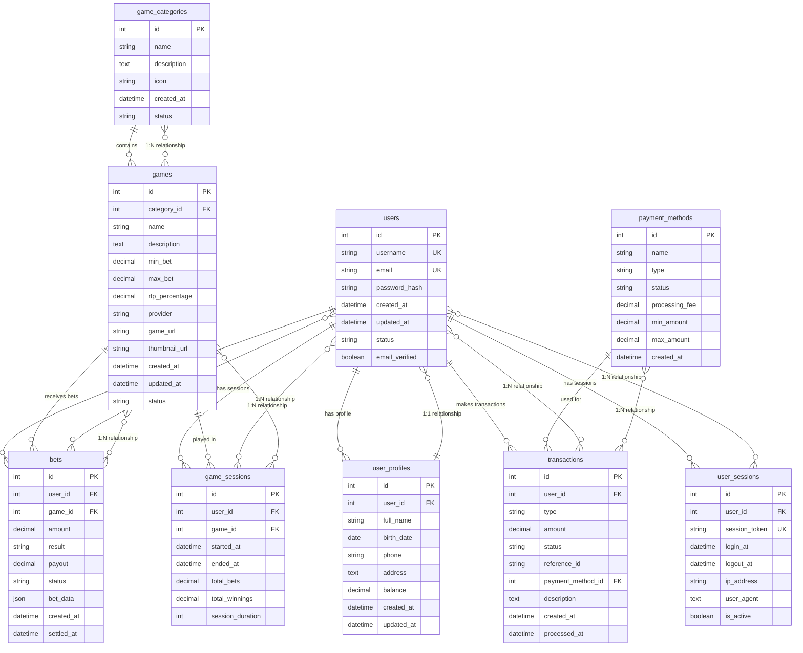

# Casino Betting Platform Database

Um banco de dados SQLite completo para uma plataforma de apostas online focada em jogos de casino (slots, poker, roleta, blackjack, etc.).

## 🎯 Características

- **Foco em Casino**: Especializado em jogos de casino (slots, poker, roleta, blackjack, baccarat, dados)
- **Gestão de Usuários**: Sistema completo de registro e perfis de usuários
- **Sistema de Apostas**: Controle de apostas simples (vitória/derrota)
- **Transações Financeiras**: Histórico completo de depósitos, saques, apostas e ganhos
- **Auditoria**: Rastreamento de sessões e atividades dos usuários

## 🗄️ Diagrama do Sistema de Banco de Dados



## 📁 Estrutura do Projeto

```
database/
├── schema.sql          # Esquema completo do banco de dados
├── seed_data.sql       # Dados de exemplo para testes
├── init_db.py          # Script Python para inicializar o banco
├── queries.sql         # Consultas SQL comuns e exemplos
└── casino_betting.db   # Banco de dados SQLite (gerado automaticamente)
```

## 🚀 Como Usar

### 1. Inicializar o Banco de Dados

```bash
# Executar o script de inicialização
python database/init_db.py

# Ou especificar um caminho customizado
python database/init_db.py meu_banco.db
```

---

## 👨‍💻 Instruções para o Time de Desenvolvimento

### 🎯 Visão Geral
Este banco de dados SQLite foi projetado para suportar uma plataforma completa de apostas online focada em jogos de casino. Siga estas instruções para integrar o banco ao seu projeto backend e frontend.

### 📋 Pré-requisitos
- Python 3.7+ instalado
- Node.js 16+ (para frontend)
- Git configurado
- Editor de código (VS Code recomendado)

---

### 🔧 Setup para Desenvolvedores Backend

#### Passo 1: Clonar e Configurar o Banco
```bash
# 1. Clone o repositório (se ainda não fez)
git clone <url-do-repositorio>
cd dados

# 2. Navegue até a pasta do banco
cd database

# 3. Execute o script de inicialização
python init_db.py
```

#### Passo 2: Verificar a Instalação
```bash
# Verifique se o banco foi criado
ls -la casino_betting.db

# Execute uma consulta de teste
sqlite3 casino_betting.db "SELECT COUNT(*) FROM users;"
```

#### Passo 3: Integração com Backend (Node.js/Express)
```javascript
// 1. Instale as dependências
npm install sqlite3 express bcryptjs jsonwebtoken

// 2. Configure a conexão com o banco
const sqlite3 = require('sqlite3').verbose();
const db = new sqlite3.Database('./database/casino_betting.db');

// 3. Exemplo de consulta para buscar usuários
app.get('/api/users', (req, res) => {
    db.all("SELECT id, username, email, created_at FROM users WHERE status = 'active'", 
        (err, rows) => {
            if (err) {
                res.status(500).json({ error: err.message });
                return;
            }
            res.json(rows);
        });
});
```

#### Passo 4: Integração com Backend (Python/Flask)
```python
# 1. Instale as dependências
pip install sqlite3 flask flask-cors

# 2. Configure a conexão
import sqlite3
from flask import Flask, jsonify

app = Flask(__name__)
DB_PATH = './database/casino_betting.db'

# 3. Exemplo de consulta
@app.route('/api/users')
def get_users():
    conn = sqlite3.connect(DB_PATH)
    cursor = conn.cursor()
    cursor.execute("SELECT id, username, email, created_at FROM users WHERE status = 'active'")
    users = cursor.fetchall()
    conn.close()
    return jsonify(users)
```

#### Passo 5: APIs Essenciais para Implementar
```javascript
// Endpoints recomendados para o backend:

// Autenticação
POST /api/auth/login
POST /api/auth/register
POST /api/auth/logout

// Usuários
GET /api/users/profile
PUT /api/users/profile
GET /api/users/balance

// Jogos
GET /api/games
GET /api/games/:id
GET /api/games/category/:categoryId

// Apostas
POST /api/bets
GET /api/bets/history
GET /api/bets/statistics

// Transações
POST /api/transactions/deposit
POST /api/transactions/withdrawal
GET /api/transactions/history

// Sessões de Jogo
POST /api/sessions/start
PUT /api/sessions/:id/end
GET /api/sessions/history
```

---

### 🎨 Setup para Desenvolvedores Frontend

#### Passo 1: Configurar o Ambiente
```bash
# 1. Instale o Node.js e npm
# 2. Crie um novo projeto React/Vue/Angular
npx create-react-app casino-frontend
cd casino-frontend

# 3. Instale bibliotecas úteis
npm install axios react-router-dom @mui/material @emotion/react @emotion/styled
```

#### Passo 2: Configurar as Chamadas de API
```javascript
// src/services/api.js
import axios from 'axios';

const API_BASE_URL = 'http://localhost:3001/api'; // Ajuste conforme seu backend

const api = axios.create({
  baseURL: API_BASE_URL,
  headers: {
    'Content-Type': 'application/json',
  },
});

// Interceptor para adicionar token de autenticação
api.interceptors.request.use((config) => {
  const token = localStorage.getItem('authToken');
  if (token) {
    config.headers.Authorization = `Bearer ${token}`;
  }
  return config;
});

export default api;
```

#### Passo 3: Componentes Principais para Implementar
```javascript
// src/components/GameList.jsx
import React, { useState, useEffect } from 'react';
import api from '../services/api';

const GameList = () => {
  const [games, setGames] = useState([]);
  const [loading, setLoading] = useState(true);

  useEffect(() => {
    const fetchGames = async () => {
      try {
        const response = await api.get('/games');
        setGames(response.data);
      } catch (error) {
        console.error('Erro ao carregar jogos:', error);
      } finally {
        setLoading(false);
      }
    };

    fetchGames();
  }, []);

  return (
    <div>
      {loading ? (
        <p>Carregando jogos...</p>
      ) : (
        <div className="games-grid">
          {games.map(game => (
            <div key={game.id} className="game-card">
              <h3>{game.name}</h3>
              <p>{game.description}</p>
              <p>Aposta mínima: R$ {game.min_bet}</p>
              <p>Aposta máxima: R$ {game.max_bet}</p>
              <button onClick={() => playGame(game.id)}>
                Jogar Agora
              </button>
            </div>
          ))}
        </div>
      )}
    </div>
  );
};

export default GameList;
```

#### Passo 4: Páginas Essenciais para Criar
```
src/
├── components/
│   ├── GameList.jsx
│   ├── UserProfile.jsx
│   ├── BettingHistory.jsx
│   ├── TransactionHistory.jsx
│   └── GameSession.jsx
├── pages/
│   ├── Home.jsx
│   ├── Games.jsx
│   ├── Profile.jsx
│   ├── History.jsx
│   └── Login.jsx
└── services/
    └── api.js
```

---

### 🗄️ Consultas Úteis para Desenvolvimento

#### Consultas de Teste Rápido
```sql
-- Verificar estrutura do banco
.tables

-- Contar registros em cada tabela
SELECT 'users' as tabela, COUNT(*) as total FROM users
UNION ALL
SELECT 'games', COUNT(*) FROM games
UNION ALL
SELECT 'bets', COUNT(*) FROM bets;

-- Buscar usuário de teste
SELECT * FROM users WHERE username = 'testuser1';

-- Listar jogos por categoria
SELECT gc.name as categoria, g.name as jogo, g.min_bet, g.max_bet 
FROM games g 
JOIN game_categories gc ON g.category_id = gc.id 
ORDER BY gc.name, g.name;
```

#### Consultas para Dashboard
```sql
-- Estatísticas gerais da plataforma
SELECT 
    (SELECT COUNT(*) FROM users WHERE status = 'active') as usuarios_ativos,
    (SELECT COUNT(*) FROM games WHERE status = 'active') as jogos_ativos,
    (SELECT COUNT(*) FROM bets) as total_apostas,
    (SELECT SUM(amount) FROM bets) as valor_total_apostado,
    (SELECT SUM(balance) FROM user_profiles) as saldo_total_usuarios;
```

---

### 🔄 Fluxo de Trabalho Recomendado

#### Para Backend Developers:
1. **Setup inicial**: Execute `python database/init_db.py`
2. **Explore o banco**: Use as consultas em `queries.sql`
3. **Implemente APIs**: Comece com autenticação e CRUD básico
4. **Teste**: Use os dados de exemplo incluídos
5. **Documente**: Documente suas APIs com Swagger/OpenAPI

#### Para Frontend Developers:
1. **Setup inicial**: Configure o ambiente de desenvolvimento
2. **Mock APIs**: Use dados estáticos inicialmente
3. **Integre APIs**: Conecte com o backend quando estiver pronto
4. **Teste**: Use os usuários de teste (testuser1, testuser2, vipuser)
5. **Responsivo**: Garanta compatibilidade mobile

---

### 🧪 Dados de Teste Disponíveis

O banco inclui dados de exemplo prontos para desenvolvimento:

**Usuários de Teste:**
- `testuser1` / `test1@example.com` (Saldo: R$ 1.000,00)
- `testuser2` / `test2@example.com` (Saldo: R$ 2.500,00)
- `vipuser` / `vip@example.com` (Saldo: R$ 10.000,00)
- Senha padrão para todos: `password123`

**Jogos Disponíveis:**
- 25+ jogos de casino em 8 categorias
- Slots, Poker, Roleta, Blackjack, Baccarat, Dados
- Jogos ao vivo e jackpots progressivos

**Transações e Apostas:**
- Histórico de depósitos e apostas
- Sessões de jogo de exemplo
- Dados para testar relatórios e analytics

---

### 🚨 Pontos Importantes

#### Segurança:
- **NUNCA** commite senhas reais no código
- Use variáveis de ambiente para configurações sensíveis
- Implemente validação de entrada em todas as APIs
- Use HTTPS em produção

#### Performance:
- O banco inclui índices otimizados
- Use paginação em listagens longas
- Implemente cache para dados que mudam pouco
- Monitore queries lentas

#### Escalabilidade:
- SQLite é ótimo para desenvolvimento e testes
- Para produção, considere PostgreSQL ou MySQL
- Implemente migrações de banco de dados
- Use connection pooling

---

### 📞 Suporte e Dúvidas

Se encontrar problemas ou tiver dúvidas:

1. **Verifique a documentação**: Leia este README completamente
2. **Execute os testes**: Use `python database/init_db.py` para verificar
3. **Consulte as queries**: Veja exemplos em `database/queries.sql`
4. **Teste com dados de exemplo**: Use os usuários e jogos pré-carregados

**Comandos úteis para debug:**
```bash
# Verificar se o banco existe e está íntegro
sqlite3 database/casino_betting.db ".schema"

# Executar consultas de teste
sqlite3 database/casino_betting.db "SELECT * FROM users LIMIT 5;"

# Recriar o banco se necessário
rm database/casino_betting.db && python database/init_db.py
```

### 2. Estrutura das Tabelas

#### Gestão de Usuários
- **users**: Dados básicos de registro (username, email, senha)
- **user_profiles**: Informações estendidas (nome completo, saldo, telefone)

#### Jogos de Casino
- **game_categories**: Categorias de jogos (Slots, Poker, Roleta, etc.)
- **games**: Jogos disponíveis com limites de apostas e RTP

#### Sistema de Apostas
- **bets**: Registro de todas as apostas (valor, resultado, pagamento)
- **game_sessions**: Sessões de jogo dos usuários

#### Transações Financeiras
- **transactions**: Histórico completo (depósitos, saques, apostas, ganhos)
- **payment_methods**: Métodos de pagamento disponíveis

#### Auditoria
- **user_sessions**: Controle de login/logout

### 3. Consultas Úteis

O arquivo `queries.sql` contém exemplos de consultas para:

- **Gestão de Usuários**: Buscar usuários, perfis, saldos
- **Jogos**: Listar jogos por categoria, provedor
- **Apostas**: Histórico de apostas, estatísticas
- **Financeiro**: Transações, resumos financeiros
- **Analytics**: Estatísticas da plataforma, receita
- **Segurança**: Usuários inativos, padrões suspeitos

## 🎮 Jogos Incluídos

### Slots
- Mega Fortune (jackpot progressivo)
- Starburst (wilds expansivos)
- Book of Dead (giros gratuitos)
- Gonzo's Quest (avalanche 3D)

### Poker
- Texas Hold'em
- Omaha Hold'em
- Three Card Poker
- Caribbean Stud Poker

### Roleta
- European Roulette
- American Roulette
- French Roulette
- Lightning Roulette

### Blackjack
- Classic Blackjack
- Blackjack Surrender
- Vegas Strip Blackjack
- Blackjack Party

### Outros
- Baccarat
- Craps
- Sic Bo
- Dragon Tiger
- Jogos ao vivo
- Jackpots progressivos

## 💰 Métodos de Pagamento

- **PIX** (sem taxa)
- **Cartão de Crédito** (2.50% taxa)
- **Cartão de Débito** (1.50% taxa)
- **Transferência Bancária** (5.00% taxa)
- **PayPal** (3.00% taxa)
- **Bitcoin** (1.00% taxa)

## 📊 Dados de Exemplo

O banco inclui dados de exemplo com:
- 3 usuários de teste
- 8 categorias de jogos
- 25+ jogos de casino
- 6 métodos de pagamento
- Transações e apostas de exemplo
- Sessões de usuário

## 🔧 Tecnologias

- **SQLite**: Banco de dados leve e portável
- **Python**: Script de inicialização
- **SQL**: Consultas otimizadas com índices

## 📈 Recursos Avançados

- **Índices**: Otimização de consultas frequentes
- **Constraints**: Integridade referencial
- **Triggers**: Atualizações automáticas de timestamps
- **JSON**: Dados flexíveis de apostas
- **Auditoria**: Rastreamento completo de atividades

## 🛡️ Segurança

- Senhas com hash seguro
- Controle de sessões
- Rastreamento de IP
- Verificação de email
- Status de usuário (ativo/inativo/suspenso/banido)

## 📝 Próximos Passos

1. Conectar ao banco usando seu cliente SQLite preferido
2. Executar consultas do `queries.sql` para operações comuns
3. Desenvolver sua aplicação de casino!
4. Implementar APIs REST para integração
5. Adicionar sistema de autenticação JWT
6. Implementar notificações em tempo real

## 🤝 Contribuição

Este banco de dados foi projetado para ser:
- **Simples**: Estrutura intuitiva e fácil de entender
- **Escalável**: Preparado para crescimento
- **Flexível**: Fácil de estender com novos recursos
- **Performático**: Otimizado para consultas rápidas

---

**Desenvolvido para plataformas de apostas online focadas em jogos de casino** 🎰