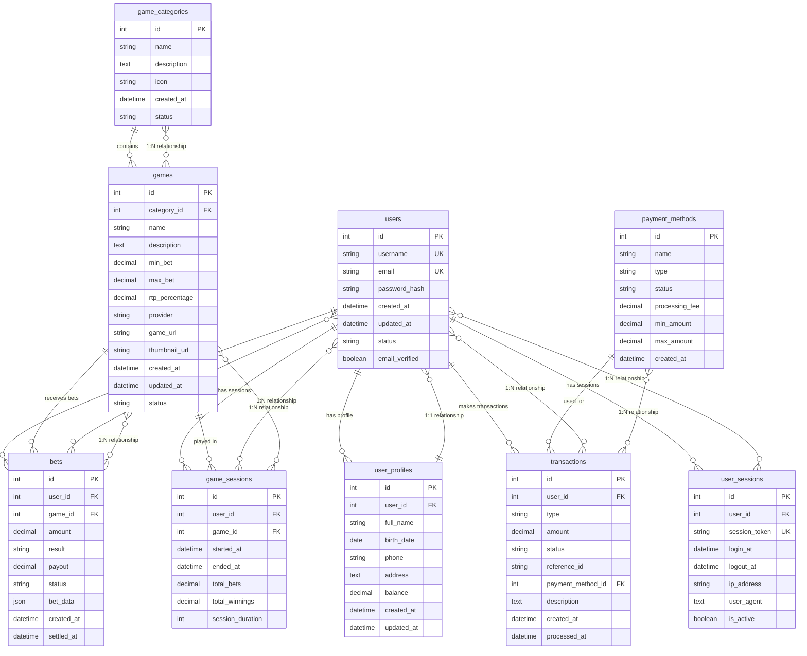
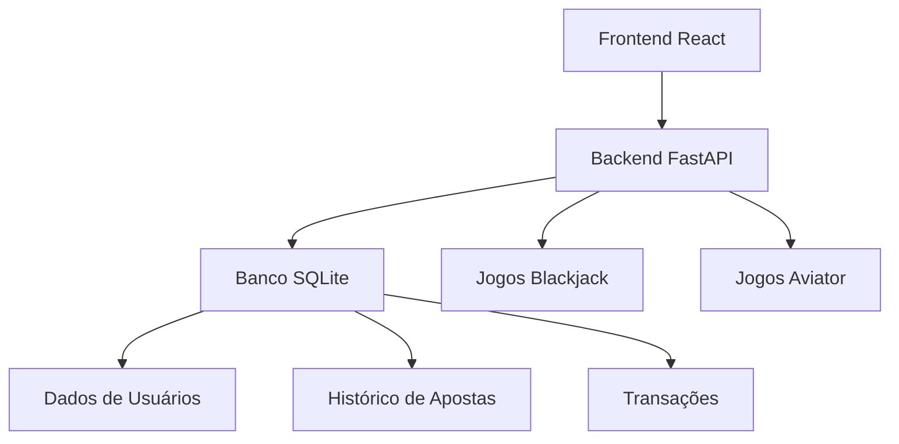

# Casino Betting Platform Database

Um banco de dados SQLite completo para uma plataforma de apostas online focada em jogos de casino (slots, poker, roleta, blackjack, etc.).

## 📋 Sumário

### 👥 Para Equipes de Desenvolvimento
- [🔧 **Equipe Backend**](#-para-equipe-backend) - Setup, integração e APIs
- [🎨 **Equipe Frontend**](#-para-equipe-frontend) - Configuração e componentes
- [🔗 **Equipe de Integração**](#-para-equipe-de-integração) - Conectar sistemas

### 📚 Documentação Técnica
- [🎯 Características](#-características) - Funcionalidades do banco
- [🗄️ Diagrama do Sistema](#️-diagrama-do-sistema-de-banco-de-dados) - Estrutura das tabelas
- [📁 Estrutura do Projeto](#-estrutura-do-projeto) - Organização dos arquivos
- [🚀 Como Usar](#-como-usar) - Setup básico
- [🧪 Dados de Teste](#-dados-de-exemplo) - Usuários e dados de exemplo

---

## 🎯 Características

- **Foco em Casino**: Especializado em jogos de casino (slots, poker, roleta, blackjack, baccarat, dados)
- **Gestão de Usuários**: Sistema completo de registro e perfis de usuários
- **Sistema de Apostas**: Controle de apostas simples (vitória/derrota)
- **Transações Financeiras**: Histórico completo de depósitos, saques, apostas e ganhos
- **Auditoria**: Rastreamento de sessões e atividades dos usuários

## 🗄️ Diagrama do Sistema de Banco de Dados



## 📁 Estrutura do Projeto

```
database/
├── schema.sql          # Esquema completo do banco de dados
├── seed_data.sql       # Dados de exemplo para testes
├── init_db.py          # Script Python para inicializar o banco
├── queries.sql         # Consultas SQL comuns e exemplos
└── casino_betting.db   # Banco de dados SQLite (gerado automaticamente)
```

## 🚀 Como Usar

### 1. Inicializar o Banco de Dados

```bash
# Executar o script de inicialização
python database/init_db.py

# Ou especificar um caminho customizado
python database/init_db.py meu_banco.db
```

---

## 🔧 Para Equipe Backend

### 📍 Repositório do Backend
**🔗 Backend Repository:** [https://github.com/InovaByte-bet/backend.git](https://github.com/InovaByte-bet/backend.git)

O time de backend já está desenvolvendo com **Python + FastAPI** e implementou:
- ✅ API para Blackjack
- ✅ API para Aviator (Crash Game)
- ✅ Estrutura modular por jogo

### 🎯 Suas Tarefas Principais

#### 1. Integrar com Este Banco de Dados
```bash
# 1. Clone este repositório de dados
git clone <url-do-repositorio-dados>
cd dados

# 2. Execute o setup do banco
cd database
python init_db.py

# 3. Integre com seu backend FastAPI
```

#### 2. Configuração de Conexão (Python/SQLite)
```python
# Adicione ao seu backend FastAPI
import sqlite3
from fastapi import FastAPI

app = FastAPI()
DB_PATH = '../dados/database/casino_betting.db'

def get_db_connection():
    conn = sqlite3.connect(DB_PATH)
    conn.row_factory = sqlite3.Row
    return conn

# Exemplo de endpoint para usuários
@app.get("/api/users")
async def get_users():
    conn = get_db_connection()
    cursor = conn.execute("SELECT * FROM users WHERE status = 'active'")
    users = cursor.fetchall()
    conn.close()
    return [dict(user) for user in users]
```

#### 3. APIs que Vocês Precisam Implementar
```python
# Autenticação (integrar com sistema de usuários)
POST /api/auth/login
POST /api/auth/register

# Gestão de Usuários
GET /api/users/profile
PUT /api/users/profile
GET /api/users/balance

# Sistema de Apostas (integrar com Blackjack/Aviator)
POST /api/bets
GET /api/bets/history
GET /api/bets/statistics

# Transações Financeiras
POST /api/transactions/deposit
POST /api/transactions/withdrawal
GET /api/transactions/history

# Sessões de Jogo
POST /api/sessions/start
PUT /api/sessions/:id/end
```

#### 4. Dados de Teste Disponíveis
- **Usuários:** `testuser1`, `testuser2`, `vipuser` (senha: `password123`)
- **Jogos:** 25+ jogos já cadastrados
- **Transações:** Histórico de exemplo

---

## 🎨 Para Equipe Frontend

### 🎯 Suas Tarefas Principais

#### 1. Setup do Ambiente
```bash
# 1. Crie seu projeto React/Vue/Angular
npx create-react-app casino-frontend
cd casino-frontend

# 2. Instale dependências essenciais
npm install axios react-router-dom @mui/material
```

#### 2. Configurar Conexão com Backend
```javascript
// src/services/api.js
import axios from 'axios';

const API_BASE_URL = 'http://localhost:8000/api'; // Backend FastAPI

const api = axios.create({
  baseURL: API_BASE_URL,
  headers: {
    'Content-Type': 'application/json',
  },
});

export default api;
```

#### 3. Componentes Essenciais para Desenvolver
```
src/
├── components/
│   ├── GameList.jsx          # Lista de jogos disponíveis
│   ├── UserProfile.jsx       # Perfil do usuário
│   ├── BettingHistory.jsx    # Histórico de apostas
│   ├── TransactionHistory.jsx # Histórico financeiro
│   ├── GameSession.jsx       # Interface dos jogos
│   └── BlackjackGame.jsx     # Interface específica do Blackjack
├── pages/
│   ├── Home.jsx              # Página inicial
│   ├── Games.jsx             # Catálogo de jogos
│   ├── Profile.jsx           # Perfil do usuário
│   ├── History.jsx           # Históricos
│   └── Login.jsx             # Autenticação
└── services/
    └── api.js                # Configuração da API
```

#### 4. Integração com Jogos
- **Blackjack:** Conecte com `/blackjack/*` endpoints
- **Aviator:** Conecte com `/aviator/*` endpoints
- **Dados do usuário:** Use endpoints de usuários e transações

---

## 🔗 Para Equipe de Integração

### 🎯 Suas Tarefas Principais

#### 1. Conectar os Sistemas


#### 2. Fluxo de Integração
1. **Backend ↔ Banco:** APIs REST conectando com SQLite
2. **Frontend ↔ Backend:** Chamadas HTTP para FastAPI
3. **Jogos ↔ Sistema:** Integração dos jogos com dados de usuários

#### 3. Pontos de Integração Críticos
```python
# 1. Autenticação unificada
# 2. Saldo de usuários sincronizado
# 3. Histórico de apostas centralizado
# 4. Transações financeiras rastreadas
```

#### 4. Testes de Integração
```bash
# Teste completo do fluxo
1. Usuário faz login (Frontend → Backend → Banco)
2. Usuário joga Blackjack (Frontend → Backend → Jogo → Banco)
3. Aposta é registrada (Jogo → Backend → Banco)
4. Saldo é atualizado (Banco → Backend → Frontend)
```

---

## 🗄️ Consultas Úteis para Desenvolvimento

### Consultas de Teste Rápido
```sql
-- Verificar estrutura do banco
.tables

-- Contar registros em cada tabela
SELECT 'users' as tabela, COUNT(*) as total FROM users
UNION ALL
SELECT 'games', COUNT(*) FROM games
UNION ALL
SELECT 'bets', COUNT(*) FROM bets;

-- Buscar usuário de teste
SELECT * FROM users WHERE username = 'testuser1';

-- Listar jogos por categoria
SELECT gc.name as categoria, g.name as jogo, g.min_bet, g.max_bet 
FROM games g 
JOIN game_categories gc ON g.category_id = gc.id 
ORDER BY gc.name, g.name;
```

### Consultas para Dashboard
```sql
-- Estatísticas gerais da plataforma
SELECT 
    (SELECT COUNT(*) FROM users WHERE status = 'active') as usuarios_ativos,
    (SELECT COUNT(*) FROM games WHERE status = 'active') as jogos_ativos,
    (SELECT COUNT(*) FROM bets) as total_apostas,
    (SELECT SUM(amount) FROM bets) as valor_total_apostado,
    (SELECT SUM(balance) FROM user_profiles) as saldo_total_usuarios;
```

---

## 🧪 Dados de Teste Disponíveis

### Usuários de Teste
- `testuser1` / `test1@example.com` (Saldo: R$ 1.000,00)
- `testuser2` / `test2@example.com` (Saldo: R$ 2.500,00)
- `vipuser` / `vip@example.com` (Saldo: R$ 10.000,00)
- **Senha padrão:** `password123`

### Jogos Disponíveis
- 25+ jogos de casino em 8 categorias
- Slots, Poker, Roleta, Blackjack, Baccarat, Dados
- Jogos ao vivo e jackpots progressivos

### Transações e Apostas
- Histórico de depósitos e apostas
- Sessões de jogo de exemplo
- Dados para testar relatórios e analytics

---

## 🚨 Pontos Importantes para Todas as Equipes

### Segurança
- **NUNCA** commite senhas reais no código
- Use variáveis de ambiente para configurações sensíveis
- Implemente validação de entrada em todas as APIs
- Use HTTPS em produção

### Performance
- O banco inclui índices otimizados
- Use paginação em listagens longas
- Implemente cache para dados que mudam pouco
- Monitore queries lentas

### Escalabilidade
- SQLite é ótimo para desenvolvimento e testes
- Para produção, considere PostgreSQL ou MySQL
- Implemente migrações de banco de dados
- Use connection pooling

---

## 📞 Suporte e Dúvidas

### Comandos Úteis para Debug
```bash
# Verificar se o banco existe e está íntegro
sqlite3 database/casino_betting.db ".schema"

# Executar consultas de teste
sqlite3 database/casino_betting.db "SELECT * FROM users LIMIT 5;"

# Recriar o banco se necessário
rm database/casino_betting.db && python database/init_db.py
```

### Links Importantes
- **Backend Repository:** [https://github.com/InovaByte-bet/backend.git](https://github.com/InovaByte-bet/backend.git)
- **Database Repository:** Este repositório (dados)
- **Documentação FastAPI:** [https://fastapi.tiangolo.com/](https://fastapi.tiangolo.com/)

### 2. Estrutura das Tabelas

#### Gestão de Usuários
- **users**: Dados básicos de registro (username, email, senha)
- **user_profiles**: Informações estendidas (nome completo, saldo, telefone)

#### Jogos de Casino
- **game_categories**: Categorias de jogos (Slots, Poker, Roleta, etc.)
- **games**: Jogos disponíveis com limites de apostas e RTP

#### Sistema de Apostas
- **bets**: Registro de todas as apostas (valor, resultado, pagamento)
- **game_sessions**: Sessões de jogo dos usuários

#### Transações Financeiras
- **transactions**: Histórico completo (depósitos, saques, apostas, ganhos)
- **payment_methods**: Métodos de pagamento disponíveis

#### Auditoria
- **user_sessions**: Controle de login/logout

### 3. Consultas Úteis

O arquivo `queries.sql` contém exemplos de consultas para:

- **Gestão de Usuários**: Buscar usuários, perfis, saldos
- **Jogos**: Listar jogos por categoria, provedor
- **Apostas**: Histórico de apostas, estatísticas
- **Financeiro**: Transações, resumos financeiros
- **Analytics**: Estatísticas da plataforma, receita
- **Segurança**: Usuários inativos, padrões suspeitos

## 🎮 Jogos Incluídos

### Slots
- Mega Fortune (jackpot progressivo)
- Starburst (wilds expansivos)
- Book of Dead (giros gratuitos)
- Gonzo's Quest (avalanche 3D)

### Poker
- Texas Hold'em
- Omaha Hold'em
- Three Card Poker
- Caribbean Stud Poker

### Roleta
- European Roulette
- American Roulette
- French Roulette
- Lightning Roulette

### Blackjack
- Classic Blackjack
- Blackjack Surrender
- Vegas Strip Blackjack
- Blackjack Party

### Outros
- Baccarat
- Craps
- Sic Bo
- Dragon Tiger
- Jogos ao vivo
- Jackpots progressivos

## 💰 Métodos de Pagamento

- **PIX** (sem taxa)
- **Cartão de Crédito** (2.50% taxa)
- **Cartão de Débito** (1.50% taxa)
- **Transferência Bancária** (5.00% taxa)
- **PayPal** (3.00% taxa)
- **Bitcoin** (1.00% taxa)

## 📊 Dados de Exemplo

O banco inclui dados de exemplo com:
- 3 usuários de teste
- 8 categorias de jogos
- 25+ jogos de casino
- 6 métodos de pagamento
- Transações e apostas de exemplo
- Sessões de usuário

## 🔧 Tecnologias

- **SQLite**: Banco de dados leve e portável
- **Python**: Script de inicialização
- **SQL**: Consultas otimizadas com índices

## 📈 Recursos Avançados

- **Índices**: Otimização de consultas frequentes
- **Constraints**: Integridade referencial
- **Triggers**: Atualizações automáticas de timestamps
- **JSON**: Dados flexíveis de apostas
- **Auditoria**: Rastreamento completo de atividades

## 🛡️ Segurança

- Senhas com hash seguro
- Controle de sessões
- Rastreamento de IP
- Verificação de email
- Status de usuário (ativo/inativo/suspenso/banido)

## 📝 Próximos Passos

1. Conectar ao banco usando seu cliente SQLite preferido
2. Executar consultas do `queries.sql` para operações comuns
3. Desenvolver sua aplicação de casino!
4. Implementar APIs REST para integração
5. Adicionar sistema de autenticação JWT
6. Implementar notificações em tempo real

## 🤝 Contribuição

Este banco de dados foi projetado para ser:
- **Simples**: Estrutura intuitiva e fácil de entender
- **Escalável**: Preparado para crescimento
- **Flexível**: Fácil de estender com novos recursos
- **Performático**: Otimizado para consultas rápidas

---

**Desenvolvido para plataformas de apostas online focadas em jogos de casino** 🎰